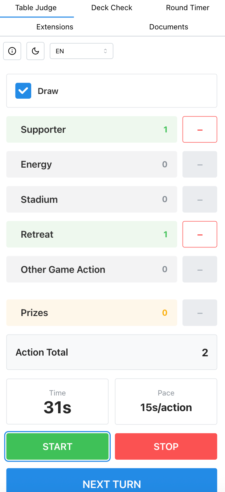
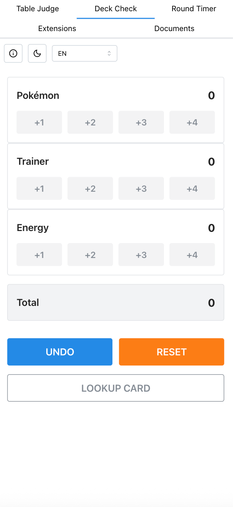
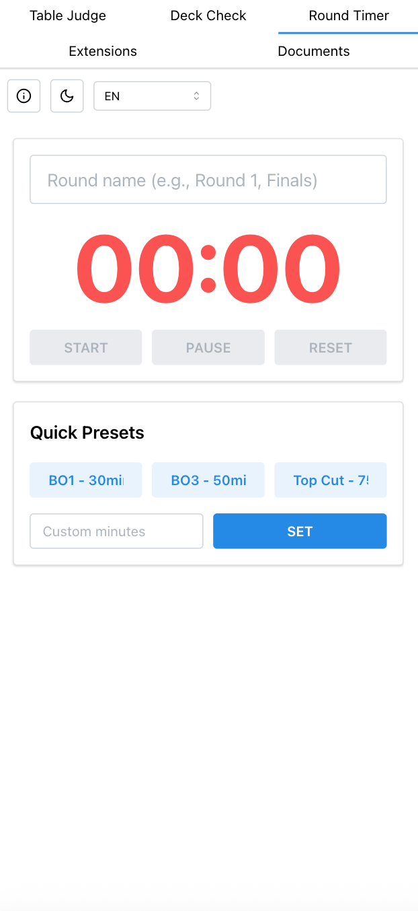
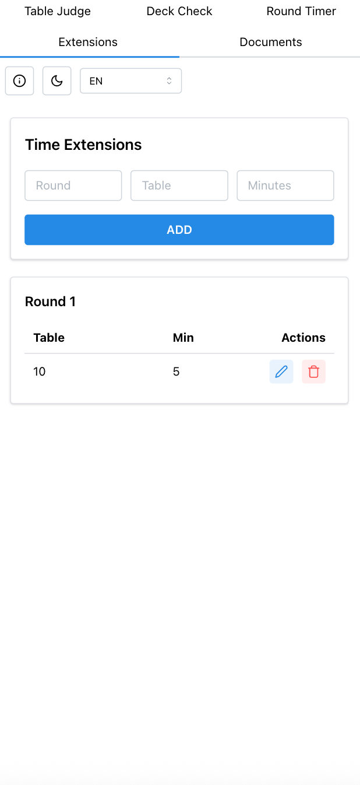
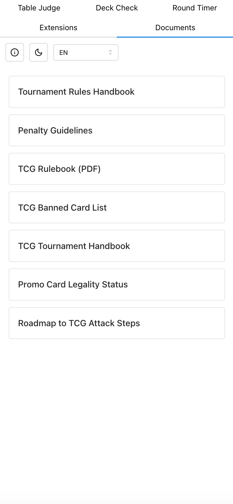

<div align="center">

# Pokemon TCG Judge Helper

[](LICENSE)
[](https://judge-helper.vercel.app)
[](CONTRIBUTING.md)

A **mobile-first** web application to assist Pokemon TCG judges during tournaments. Built for speed and simplicity — no backend, no login, works offline-ready as a PWA.

**[Live App](https://judge-helper.vercel.app)**

</div>

> **Disclaimer:** This is an independent, open-source community project. It is **not** affiliated with, endorsed by, or connected to The Pokemon Company, Nintendo, Creatures Inc., or any of their subsidiaries. Pokemon and all related trademarks are property of their respective owners.

---

## Features

| Feature | Description |
|---------|-------------|
| **Table Judge** | Track player actions (Supporter, Energy, Stadium, Retreat, etc.), turn timer with pace calculation, and prize count during a match. |
| **Deck Check** | Quick card counting tool with separate counters for Pokemon, Trainer, and Energy cards. Supports +1/+2/+3/+4 increments, undo, and reset. |
| **Round Timer** | Configurable countdown timer with quick presets (BO1 30min, BO3 50min, Top Cut 75min) and a full-screen display mode. |
| **Time Extensions** | Log and manage time extensions per table/round during a tournament. |
| **Documents** | Quick-access links to official Pokemon TCG documents (Rulebook, Tournament Handbook, Penalty Guidelines, Banned List, etc.). |

### Additional Highlights

- Dark mode support
- Internationalization — English, Portuguese, and Spanish
- PWA — installable on mobile devices
- Onboarding wizard for first-time users
- localStorage persistence — session survives page reloads
- No backend required — 100% client-side

---

## Screenshots

<div align="center">
<table>
<tr>
<td align="center"><strong>Table Judge</strong></td>
<td align="center"><strong>Deck Check</strong></td>
<td align="center"><strong>Round Timer</strong></td>
</tr>
<tr>
<td></td>
<td></td>
<td></td>
</tr>
<tr>
<td align="center"><strong>Time Extensions</strong></td>
<td align="center"><strong>Documents</strong></td>
<td></td>
</tr>
<tr>
<td></td>
<td></td>
<td></td>
</tr>
</table>
</div>

---

## Tech Stack

| Technology | Purpose |
|------------|---------|
| [React 19](https://react.dev) | UI library |
| [TypeScript](https://www.typescriptlang.org) | Type safety |
| [Vite](https://vite.dev) | Build tool & dev server |
| [Mantine 8](https://mantine.dev) | Component library |
| [React Router](https://reactrouter.com) | Client-side routing |
| [i18next](https://www.i18next.com) | Internationalization |
| [Playwright](https://playwright.dev) | End-to-end testing |
| [Bun](https://bun.sh) | JavaScript runtime & package manager |

---

## Getting Started

### Prerequisites

- [Bun](https://bun.sh) (v1.0+)

### Development

```bash
cd client
bun install
bun run dev
```

Open [http://localhost:5173](http://localhost:5173)

### Production Build

```bash
cd client
bun install
bun run build
bun run preview
```

The production build will be output to `client/dist/`.

---

## Running Tests

This project uses [Playwright](https://playwright.dev) for end-to-end testing.

```bash
cd client
bun install                    # install deps (first time)
bun exec playwright install    # install browsers (first time)
bun exec playwright test       # run all tests
```

Run a specific test:

```bash
bun exec playwright test playwright/tests/table-judge.spec.ts
```

Run with visible browser:

```bash
bun exec playwright test --headed
```

---

## Deploy to Vercel

1. Set **Root Directory** to `client` in Vercel project settings
2. Configure build settings:
   - **Build Command:** `bun run build`
   - **Output Directory:** `dist`
   - **Install Command:** `bun install`
3. The included `vercel.json` handles SPA routing automatically

---

## Project Structure

```
judge-helper/
├── client/
│   ├── src/
│   │   ├── components/        # Shared/reusable components
│   │   ├── pages/             # Route page components
│   │   ├── i18n/              # Internationalization config & locales
│   │   ├── App.tsx            # Root app with routes
│   │   └── main.tsx           # Entry point
│   ├── playwright/tests/      # E2E test specs
│   ├── public/                # Static assets & PWA manifest
│   ├── package.json
│   ├── vite.config.ts
│   └── playwright.config.ts
├── docs/                      # Project documentation
├── CONTRIBUTING.md            # Contribution guidelines
├── CODE_OF_CONDUCT.md         # Community standards
├── LICENSE                    # MIT License
└── README.md
```

---

## Contributing

Contributions are welcome! Please read the **[Contributing Guide](CONTRIBUTING.md)** before submitting a Pull Request.

**Quick summary:**

1. Fork the repository
2. Create a feature branch (`git checkout -b feature/my-feature`)
3. Follow the TDD workflow (write tests first)
4. Commit your changes
5. Open a Pull Request

All PRs require maintainer approval before merging.

See also: **[Code of Conduct](CODE_OF_CONDUCT.md)**

---

## License

This project is licensed under the [MIT License](LICENSE).
